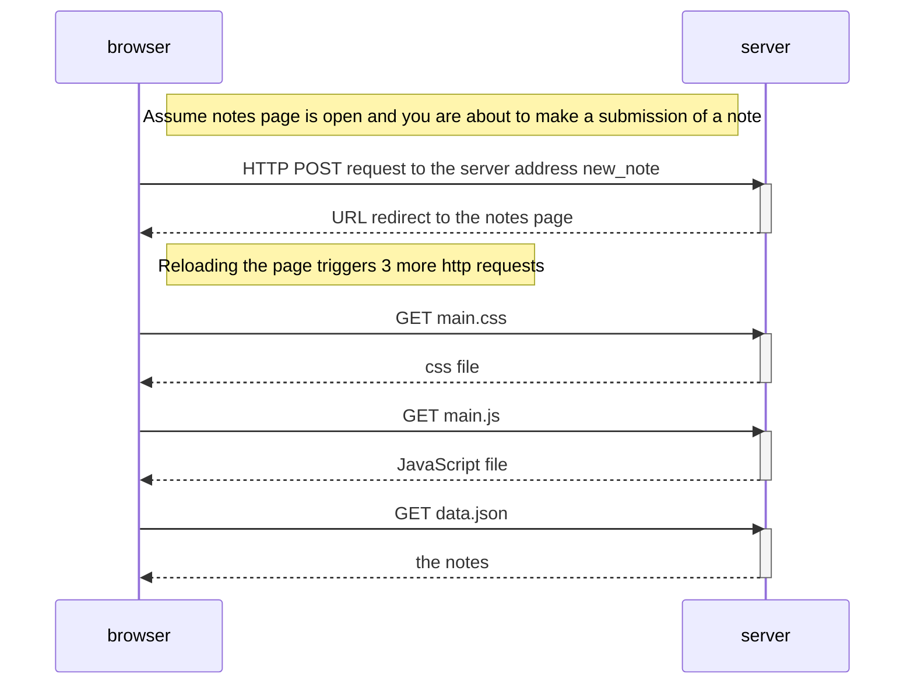

```mermaid
sequenceDiagram
    participant browser
    participant server

    Note right of browser: Assume notes page is open and you are about to make a submission of a note

    browser->>server: HTTP POST request to the server address new_note
    activate server
    server-->>browser: URL redirect to the notes page
    deactivate server

    Note right of browser: Reloading the page triggers 3 more http requests

    browser->>server: GET main.css
    activate server
    server-->>browser: css file
    deactivate server

    browser->>server: GET main.js
    activate server
    server-->>browser: JavaScript file
    deactivate server

    browser->>server: GET data.json
    activate server
    server-->>browser: the notes
    deactivate server

```
